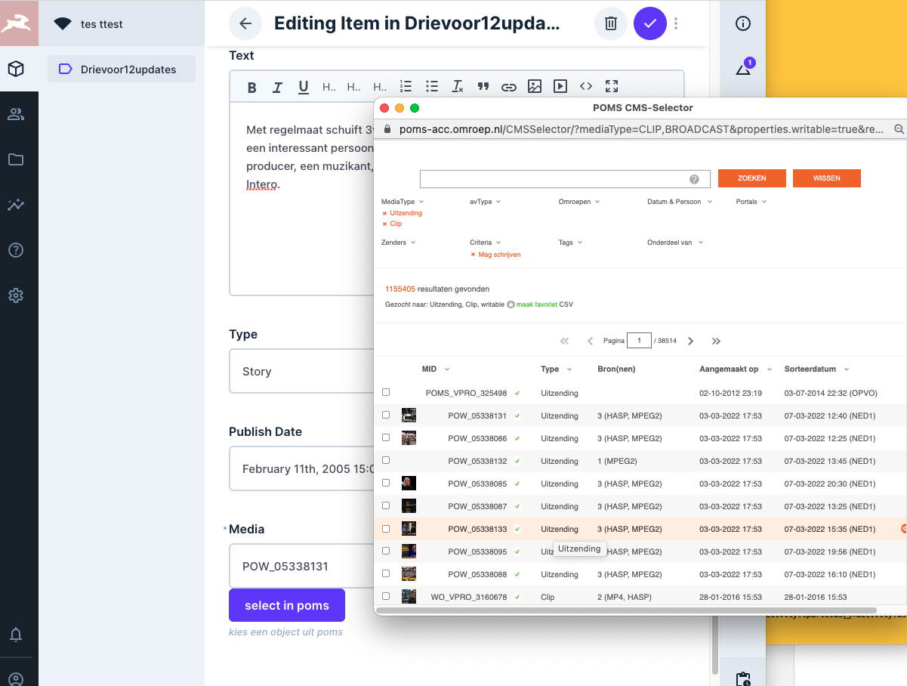

= POMS Selector for Directus

This is currently being tried as a part of a POC in our new CMS selection traject.

See also https://github.com/mihxil/directus

https://jira.vpro.nl/browse/SYS-1179

Adds a new field type 'pom selector'. This can be used to have a text-field with a button next to it 'select in poms'. This will pop up the https://poms.omroep.nl/CMSSelector/example[poms CMS selector], which allows for selecting an item from poms. The MID will be filled in the text field.

== Installation

It is made available as an https://www.npmjs.com/package/directus-extension-poms-selector[NPM package].

The field type interface will appear. And can be configured with several options of the Poms Selector itself.

== TODO

* the poms url is still hard-wired to poms-acc, this needs to be configurable (I didn't figure out yet how to do that yet)

